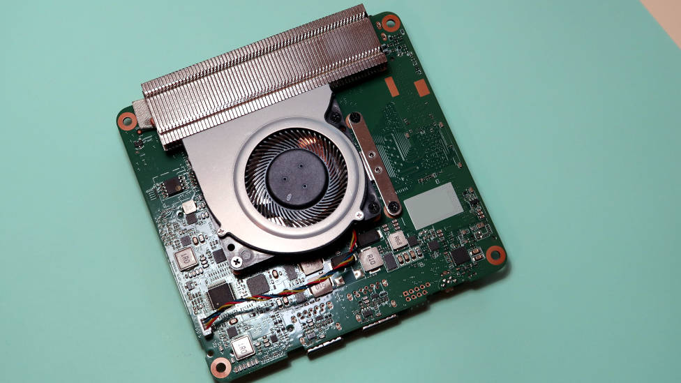
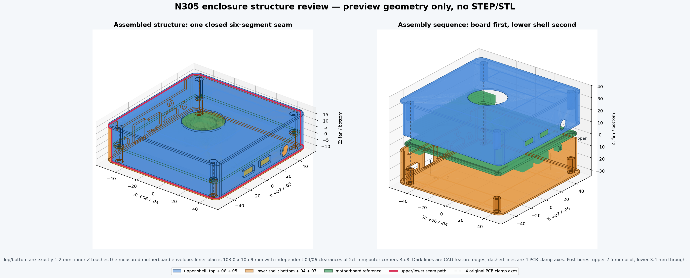
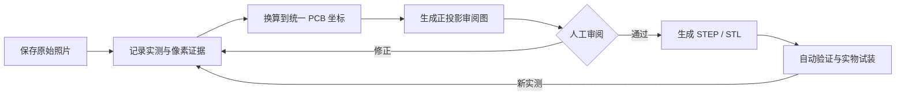
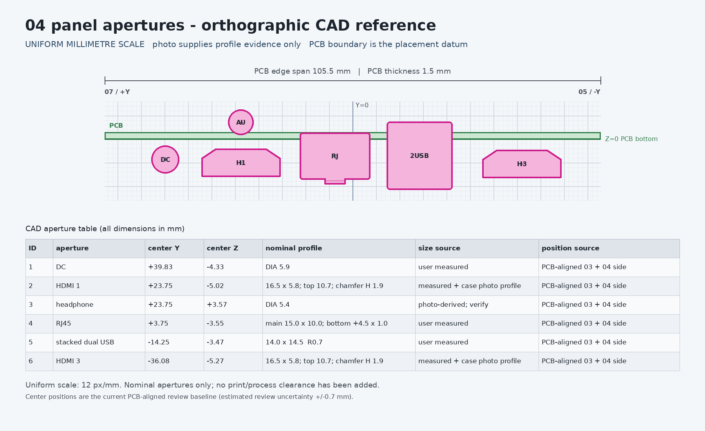
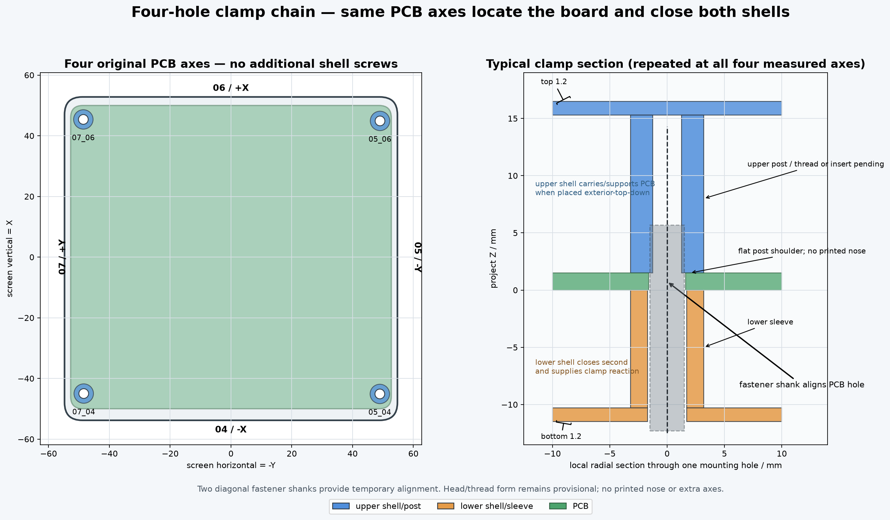
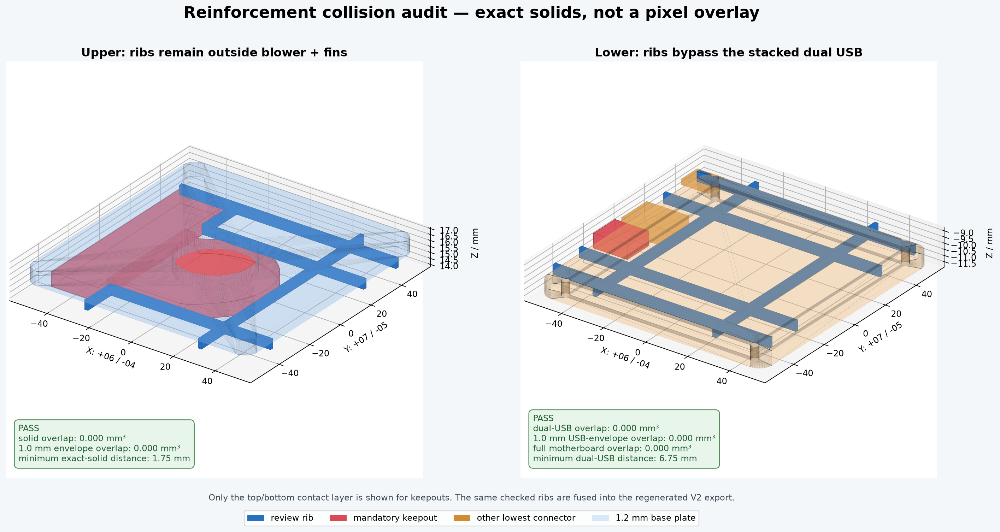

# N305 主板机械参考与可打印外壳

没有厂商机械图纸，也不意味着设计新外壳只能靠“打印、打磨、再猜一次”。这个项目从原机照片、卡尺读数和 PCB 基准出发，重建一套**可以检查、修改并重新生成**的 N305 小主机机械模型。

项目目前已经走到可以试装的阶段：仓库里既有适合二次设计的 PCB/主板 STEP、STL 参考，也有可以直接切片验证的 V2 上下壳。V2 不是最终成品，而是一版用于发现问题、收集实物反馈的工程样机——已经确认的尺寸进入 CAD，仍待验证的参数也完整保留来源和状态，方便每一次试打都能推动模型继续收敛。

如果你手上也有这块主板，可以直接下载模型试装，也可以基于主板参考设计自己的外壳。尺寸反馈、接口照片和结构改进都很有价值。

<p align="center">
  <a href="https://delightlylinux.wordpress.com/2025/07/24/gmktec-g3-fun-while-it-lasted/">
    
  </a>
</p>

_外观参考：GMKtec G3 N100 版本主板的涡轮风扇与鳍片散热器一侧。图片来自 [Delightly Linux 原文](https://delightlylinux.wordpress.com/2025/07/24/gmktec-g3-fun-while-it-lasted/)；它与本项目重建对象布局相近，但不是本项目 N305 尺寸标定证据。机械尺寸仍以 `pics/` 中的用户实拍和卡尺数据为准。_

[](exports/enclosure/v2-prototype/n305_v2_enclosure_assembly.stl)

_点击图片可在 GitHub 中打开 STL 交互预览；装配 STL 只用于检查，打印请使用独立的上壳和下壳文件。_

## 全程由 Codex 完成

这是一次用 [Codex](https://developers.openai.com/codex) 完成实体工程项目的实践。除实物拍摄、卡尺测量以及用户对方向和尺寸的确认外，照片证据整理、参数标定、建模代码、审阅图、STEP/STL 导出、自动验证和项目文档都由 Codex 在这个仓库中完成。

整个过程没有在 SolidWorks、Fusion 360、FreeCAD 等图形化专业 CAD 软件中手工建模或修补模型。Codex 编写并运行 Python/CadQuery 代码，底层使用 CadQuery、OpenCascade、Matplotlib、NumPy 和 Pillow 等开源程序库完成几何构造、图像处理和文件生成。因此，这里的 CAD 不是一组只能继续手工维护的成品文件，而是可以从参数和证据重新构建的程序化模型。

这也不是“一句话生成外壳”的演示。用户负责提供真实世界输入、识别明显错误并作出工程取舍；Codex 负责把这些反馈转化为参数、规则、代码和验证。最终结果来自多轮协作，而不是把 AI 的第一次推断当成答案。

## 快速入口

| 我想要…… | 从这里开始 |
| --- | --- |
| 直接试打 V2 外壳 | [上壳 STL](exports/enclosure/v2-prototype/n305_v2_upper_shell.stl) · [下壳 STL](exports/enclosure/v2-prototype/n305_v2_lower_shell.stl) · [试装说明](exports/enclosure/v2-prototype/README.md) |
| 选择材料和国内打印平台 | [V2 打印、下单与试装指南](docs/v2-printing-guide.md) |
| 修改 V2 外壳 | [上壳 STEP](exports/enclosure/v2-prototype/n305_v2_upper_shell.step) · [下壳 STEP](exports/enclosure/v2-prototype/n305_v2_lower_shell.step) · [参数源](src/n305_enclosure_structure.py) |
| 为主板设计自己的结构 | [完整主板 STEP](exports/reference/physical/n305_motherboard_reference.step) · [完整主板 STL](exports/reference/physical/n305_motherboard_reference.stl) · [主板模型说明](docs/motherboard-reference.md) |
| 检查尺寸和开孔依据 | [04 面参考](previews/reference/04-interface-reference.png) · [06 面参考](previews/reference/06-interface-reference.png) · [开孔覆盖检查](previews/enclosure/aperture-coverage-review.png) |
| 复现全部模型 | [构建脚本](scripts/) · [建模流程](docs/modeling-workflow.md) · [验证结果](exports/enclosure/v2-prototype/validation.json) |

## 当前进度

- [x] PCB 外形、四个原始安装孔和主板坐标系
- [x] 04/06 接口、板载开关和散热组件参考
- [x] 与物理实体分离的安装轴线和保守避让体
- [x] 面板开孔、圆角接缝和四孔夹紧结构审阅
- [x] 顶/底板 `1.5 × 0.8 mm` 内侧加强筋、器件绕行和碰撞审阅
- [x] V2 上壳、下壳及装配 STEP/STL
- [x] STEP 回读、STL 网格、实体边界和开孔覆盖自动验证
- [ ] V2 实物打印与同款主板装配反馈
- [ ] 收敛打印补偿、紧固件和按钮行程后发布制造版

## 方法与流程

这个项目最重要的产物不只是 STL，而是一套从不完整照片走向可审阅 CAD 的工作方法。顺序不能颠倒：先弄清楚证据说明了什么，再决定二维机械位置，最后才生成三维实体。



1. **保存原始证据**：原始照片保持不变，另外记录照片编号、观察方向、卡尺读数和可见轮廓。
2. **给数据分级**：明确区分用户实测、照片可读尺寸、PCB 对齐标定、轮廓证据和视觉推断；推断值必须标为 provisional。
3. **建立唯一坐标系**：以 `100.0 × 105.5 mm` PCB 和四个原始孔为机械基准，把照片信息换算成统一毫米坐标，不把画面边缘当作原点。
4. **先审二维机械图**：生成带 PCB 边界、方向、孔中心、尺寸和数据来源的正投影图，先检查接口位置与轮廓。
5. **审阅通过后再建三维**：CAD 直接读取毫米参数；物理实体、面板开孔、插头通道和保守避让体分开构造与导出。
6. **让验证成为模型的一部分**：回读 STEP、解析 STL，并检查包络、四孔、实体接触、开孔覆盖、壳体重叠和文件哈希。
7. **用试装结果闭环**：把装配松紧、接口插拔、按钮行程和紧固件结果重新写回参数，而不是只在 STL 上做一次性修补。

详细规则已经写入 [AGENTS.md](AGENTS.md)，完整操作见 [建模流程](docs/modeling-workflow.md)。这使后续 Codex 会话也必须遵守同一套坐标、数据优先级和审阅门。

## 走过的弯路

Codex 在早期重建中确实发生过多次漂移，用户的实测和审阅把模型拉回了正确轨道。这个过程也直接塑造了现在的方法论：

- 曾把照片透视和画面位置带入机械坐标，导致接口位置看似合理、实际基准却不可靠；后来强制所有位置先对齐 PCB。
- 曾把卡尺照片中的总包络差值平均分到 PCB 两侧，混淆了板宽和不同接口的突出量；后来改为按表面、按器件分别记录。
- 曾把通用 HDMI 代理当作真实接口鼻端，与已经确认的原壳六边形孔产生假冲突；现在未实测的真实轮廓明确标为“不计算”。
- 曾过早用简化形状替代散热器和风扇结构，也出现过看起来圆润但无法保持等壁厚、甚至不能完整包住 PCB 的外壳圆角方案。
- 曾在二维数据尚未稳定时直接推进三维，导致局部修正引发新的全局不一致；现在任何对象都必须先通过对应审阅门。

这些问题没有只靠修改最终模型掩盖。每次纠正都被固化成参数来源、生成规则或自动检查，目的是让同一种错误不再悄悄回来。仓库中的审阅记录因此不是附属文档，而是模型可信度的一部分。

## 设计预览

04 面的接口不是从照片像素直接描进 CAD，而是先换算到统一 PCB 坐标，再生成正投影审阅图：

[](previews/reference/04-interface-reference.png)

上下壳直接使用主板原有四孔定位和夹紧，不额外增加四颗外壳安装螺丝：

[](previews/enclosure/four-hole-clamp-section.png)

顶板和底板的内侧加强筋也不是按外观随意布置。蓝色筋路已经用精确三维实体检查：顶筋绕过完整风扇蜗壳和鳍片，底筋绕过最低的 04 堆叠双 USB，并同时与完整主板参考进行碰撞审计。当前所有交叠体积均为 `0.000 mm³`。

[](previews/enclosure/reinforcement-collision-check.png)

具体筋路、尺寸和最短距离见 [加强筋审阅](docs/enclosure-reinforcement-review.md)。

更多结构图见 [外壳结构审阅](docs/enclosure-structure-review.md)，主板风扇、鳍片和散热接触关系见 [主板模型说明](docs/motherboard-reference.md)。

## 坐标与表面命名

项目文档中的 `04`、`05`、`06`、`07` 来自照片和实物表面的统一编号。正对风扇面、鳍片朝下时：

```text
                    06 / +X
                       ↑
          07 / +Y  ←  PCB  →  05 / -Y
                       ↓
                    04 / -X

             +Z 朝风扇，PCB 底面 Z=0
```

照片编号与观察方向见 [照片索引](pics/README.md)。所有 CAD 均使用毫米，并保持同一套装配坐标。

## 哪些尺寸可以相信

这个仓库刻意保留每项数据的来源和确定程度，不把视觉估算包装成精确测量。发生冲突时，用户实测和卡尺读数优先于照片标定，照片轮廓又优先于纯视觉推断。

当前 PCB 平面为 `100.0 × 105.5 mm`。PCB 外形、原始安装孔、接口中心和总 Z 包络用于机械定位；连接器隐藏壳体、PCB 圆角、散热器局部细节以及底面器件避让体仍包含照片重建或保守近似，不能当作厂商原始 CAD。

V2 外壳中的侧壁厚度、部分结构间隙、紧固件方案、打印补偿和按钮有效行程仍需要实物试装确认。完整参数及状态见 [V2 试装说明](exports/enclosure/v2-prototype/README.md)；数据权威顺序和建模规则见 [AGENTS.md](AGENTS.md)。

## 本地复现

需要 Python 3.11 或更高版本。以下命令会建立本地环境，并从参数和照片证据重新生成审阅图、主板模型与 V2 外壳：

```bash
python -m venv .venv
.venv/bin/python -m pip install -e .
PYTHONPATH=src .venv/bin/python scripts/calibrate_photos.py
PYTHONPATH=src .venv/bin/python scripts/calibrate_components.py
PYTHONPATH=src .venv/bin/python scripts/render_mainboard_reference.py
PYTHONPATH=src .venv/bin/python scripts/build_motherboard_reference.py
PYTHONDONTWRITEBYTECODE=1 PYTHONPATH=src .venv/bin/python scripts/build_enclosure_structure_review.py
PYTHONDONTWRITEBYTECODE=1 PYTHONPATH=src .venv/bin/python scripts/build_enclosure_reinforcement_review.py
PYTHONDONTWRITEBYTECODE=1 PYTHONPATH=src .venv/bin/python scripts/build_v2_prototype_enclosure.py
```

生成过程不仅导出 STEP/STL，也会回读 STEP、解析 STL 网格并写出验证 JSON。模型、参数和审阅材料分别放在：

- `src/`：机械参数和几何构造
- `scripts/`：标定、渲染、导出与验证入口
- `pics/`：原始照片证据
- `previews/`：适合人工审阅的正投影和结构图
- `exports/`：STEP、STL、参数清单与机器验证结果
- `docs/`：方法、数据来源和审阅记录

## 参与试装

当前最有价值的贡献是真实装配反馈。开始前请先阅读 [V2 试装建议](exports/enclosure/v2-prototype/README.md)，并尽量同时记录打印机、材料、层高和切片补偿。重点需要确认：

- 04/06 方向的壳体间隙，以及 05/07 方向的插入阻力
- 四个主板孔与上下壳柱体是否同轴
- USB、HDMI、RJ45、DC 和耳机插头能否顺畅插拔
- 原机圆形按钮的安装、行程和回弹
- 实际采用的螺钉、螺纹或热熔螺母方案

请不要为了“看起来能装”而默默修改模型；把实测值、测试条件和对应表面一起留下，下一版才能真正比这一版更可靠。
