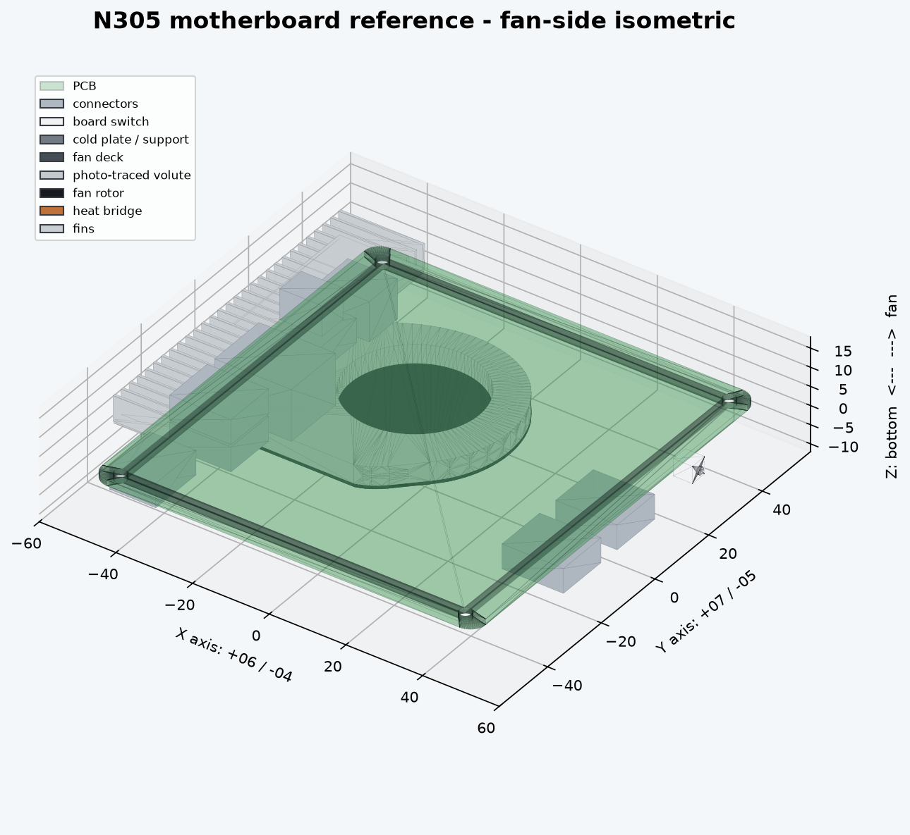

# N305 主板参考与外壳项目

当前已完成一套可复现的 **PCB/主板三维参考模型**。它包含 PCB、四个安装孔、04/06 接口实体、板载电源开关、相互接触的散热组件，以及与物理实体分离的保守避让体。当前没有生成外壳几何。



## 唯一方向

正对风扇面且鳍片在下：

```text
                    06 / +X
                       ↑
          07 / +Y  ←  PCB  →  05 / -Y
                       ↓
                    04 / -X

             +Z 朝风扇，PCB 底面 Z=0
```

照片编号与观察方向见 [pics/README.md](pics/README.md)。

## 当前有效结果

- [主板模型说明](docs/motherboard-reference.md)
- [04 面 PCB 基准正投影](previews/reference/04-interface-reference.png)
- [06 面 PCB 基准正投影](previews/reference/06-interface-reference.png)
- [散热接触链侧视图](previews/reference/cooling-contact-path.png)
- [风扇面正投影三维参考](previews/reference/motherboard-plan.png)
- [01 照片风扇蜗壳轮廓证据](previews/calibration/01-blower-profile-trace.png)
- [STEP/STL 导出说明](exports/reference/README.md)
- [机器验证结果](exports/reference/validation.json)

三维模型的主要入口是：

- 几何参数与构造：[src/n305_mainboard_reference.py](src/n305_mainboard_reference.py)
- 面板机械参数：[src/n305_panel_reference.py](src/n305_panel_reference.py)
- 构建、导出和验证：[scripts/build_motherboard_reference.py](scripts/build_motherboard_reference.py)

## 数据纪律

用户实测值和 PCB 对齐坐标高于照片视觉推断。照片只用于接口顺序、特殊轮廓和未测结构的近似，不用于反算 CAD 全局坐标。完整规则和可复用提示词已经固定在 [AGENTS.md](AGENTS.md) 与 [建模流程](docs/modeling-workflow.md) 中。

当前 PCB 外形、安装孔、接口中心和总 Z 包络用于机械定位；连接器隐藏壳体、PCB 圆角、散热器局部细节及底面器件避让体仍是照片重建/保守近似，不能当作厂商原始 CAD。

## 本地生成

```bash
python -m venv .venv
.venv/bin/python -m pip install -e .
PYTHONPATH=src .venv/bin/python scripts/calibrate_photos.py
PYTHONPATH=src .venv/bin/python scripts/calibrate_components.py
PYTHONPATH=src .venv/bin/python scripts/render_mainboard_reference.py
PYTHONPATH=src .venv/bin/python scripts/build_motherboard_reference.py
```

最后一个命令会重新导出主板 STEP/STL、三张三维预览和 `validation.json`。校验必须确认 PCB 包络、四孔、25.6 mm 裸组件厚度、06 USB 水平轮廓和连续散热接触链；同时确认没有生成外壳实体。

## 后续审阅门

先审阅主板三维参考中的接口实体、孔位和避让体。确认后再把已审阅数据作为外壳 CAD 的直接输入；不从 PNG 像素反推开孔，也不复用旧外壳 STL/STEP。
